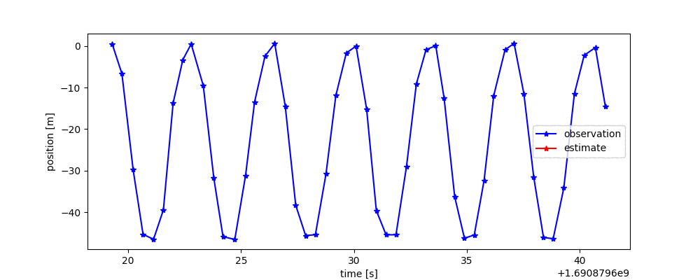
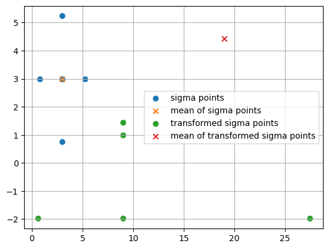
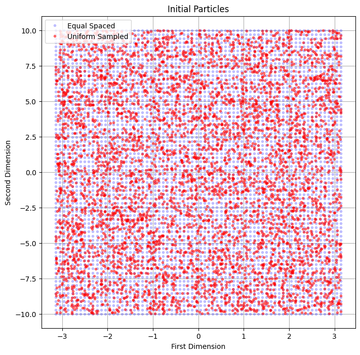
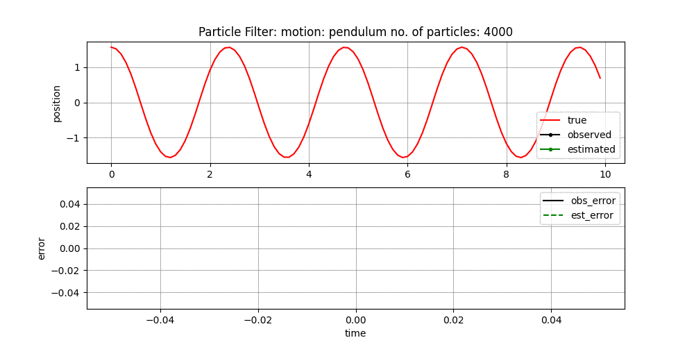

Robotics Demo
===
# 1. Kinematics - Forward and Inverse Kinematics
## Fn 1.1: Symbolic Calculation using DH Table
using symbolic math package in Python  - SymPy - to calculate forward and inverse kinematics with defined dh tables, see `1.1Kinematics_SymPy_DH.ipynb`
- matlab code is also available in the repository, but requires symbolic math toolbox

## Fn 1.2: Dual Quaternion Representation
-  self-defined dual quaternion class to transfer dh table to dual quaternion and calculate forward and inverse kinematics, see `1.2Kinematics_Robot.ipynb`

### Eg 1.1: 2D Serial Robot
using example from [this website](https://motion.cs.illinois.edu/RoboticSystems/InverseKinematics.html).
- 2D serial robot with 2 links and 2 joints
- workspace visualization (serial #TODO)

### Eg 1.2: 3D Serial Robot

- #TODO test quaternion and dual quaternion with serial robot
- inverse kinematics calculation #TODO
- forward kinematics calculation (serial #TODO)
- 3D serial robot with 3 links and 3 joints

### Eg 1.3: 2D Parrallel Robot
- 2D Parrallel Robot
- workspace visualization ( parrallel #TODO)
- inverse kinematics calculation 
- forward kinematics calculation ( parrallel#TODO)

### Eg 1.4: 3D Parrallel Robot

# 2. Visulization
<!-- using [yourdfpy](https://github.com/clemense/yourdfpy/tree/main) to load robot defined in [URDF format](http://wiki.ros.org/urdf/XML).
- "data/urdf_files": contains urdf files for different robots. [Source](https://github.com/ankurhanda/robot-assets)
## Fn 2.1: draw robot in 2D/3D space
based on yourdfpy, draw robot in 2D/3D space with matplotlib -->
dual quaternion reference frame visualisation (#TODO)
see implementations in `1.2Kinematics_Robot.ipynb`

# 3. Control Method
## Eg 3.1: Kalman Filter in Motion Tracking
with traditional Kalman Filter and Unscented Kalman Filter (filterpy package)

## Eg 3.2: Unscented Kalman Filter with 1D Pendulum
- sigma points visualization
{width=200 height=100}
- UKF estimation result (parameters sensitive)

## Eg 3.3: Particle Filter / Monte Carlo Localization in Motion Tracking
- Pariticle initialization
{width=100 height=100}
- Particle Filter estimation result (parameters sensitive)

